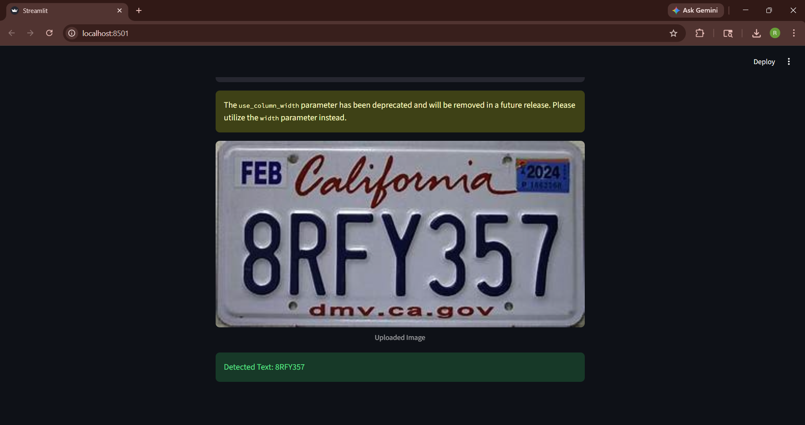

# Alphabet Detection using YOLO

This project implements a character detection system using the Ultralytics YOLO model to recognize alphabets and numeric characters from images such as license plates. It detects multiple characters and reconstructs the final output in correct left-to-right order.

---

## Overview

The system takes an input image, detects individual characters using a trained YOLO model, and generates the final predicted text based on spatial positioning.

---

## Features

* Detection of alphabets and digits from images
* Supports multiple characters in a single image
* Left-to-right sorting for correct sequence generation
* Confidence-based filtering
* Duplicate removal using distance threshold
* Streamlit-based UI for uploading images
* Batch prediction support using Python

---

## Project Structure

```
alphabet-detection-yolo/
│
├── app.py
├── predict.py
├── requirements.txt
├── README.md
├── .gitignore
│
├── test_images/
│   └── result.png
```

---

## Installation

Clone the repository:

```
git clone https://github.com/your-username/alphabet-detection-yolo.git
cd alphabet-detection-yolo
```

Install dependencies:

```
pip install -r requirements.txt
```

---

## Model File

The trained model file (`best.pt`) is not included due to size limitations.

Place your model here:

```
runs/detect/train/weights/best.pt
```

(Add your Google Drive link if needed)

---

## Usage

### Run Web UI

```
streamlit run app.py
```

Open in browser:

```
http://localhost:8501
```

---

### Run Batch Prediction

```
python predict.py
```

---

## Example Result



Detected Output: 8RFY357

---

## Working Methodology

1. Input image is passed to the YOLO model
2. Characters are detected using bounding boxes
3. Low-confidence predictions are filtered
4. Characters are sorted from left to right
5. Duplicate detections are removed
6. Final text is generated

---

## Technologies Used

* Python
* Ultralytics YOLO
* Streamlit
* NumPy
* Pillow

---

## Limitations

* Accuracy depends on dataset quality
* Similar characters (O/0, I/1) may be confused
* Performance may vary on blurred images

---

## Future Improvements

* Improve dataset and training
* Add bounding box visualization
* Real-time webcam detection
* Deploy as a web application

---

## License

This project is intended for educational and research purposes.

---

## Important

Make sure this file exists in your repository:

```
test_images/result.png
```

Otherwise the image will not display in GitHub.
